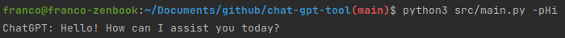

# ChatGPT Command Tool

## Table of Contents
  * [Environment](#environment)
  * [Arguments](#arguments)
  * [Examples](#examples)
    + [Text Geneartion](#text-geneartion)
    + [Image Geneartion](#image-geneartion)
  * [Use it from your console](#use-it-from-your-console)

## Environment

Create `.env` file with the following content:
 ```dotenv
OPEN_AI_URL="https://api.openai.com/v1"
OPEN_AI_API_KEY=<YOUR_API_KEY>
 ```

## Arguments

**-o --operation (default=txt)**

Indicates the operation to execute.\
Possible values are: `img | txt`

**-s --size (only for img)**

Indicates the size of the generated image.\
Possible values are: `1024 | 512 | 256`

**-c --continuous (only for txt)**

This field indicates if the tool should keep asking for new prompts after ChatGPT response.

**-p --prompt**

This field sets the initial prompt to request ChatGPT.

## Examples

### Text Geneartion

 ```sh
python3 src/main.py -p "Hi"
 ```



### Image Geneartion
 ```sh
python3 src/main.py -oimg -s1024 -p "ocean painting"
 ```


## Use it from your console
1. Move the content of the `src` folder to `/usr/local/bin/chat-gpt-tool`
2. Rename main.py to cgpt
3. Add `export PATH="$PATH:/usr/local/bin/chat-gpt-tool"` to your `~/.bashrc` file
4. Done, use cgpt command from anywhere!
